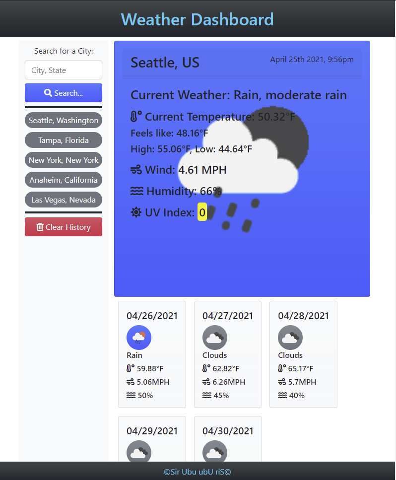

# Weather Dashboard
What's the weather like?? Get a read on any city you'd like with this easy to use weather application. Plan your day/trip by having access to the current weather of your search result as well as a layout of the next 5 day forecast. You'll be able to see your search history and can easily click on a previous search to see that results information again.

## Description
Enter the city you'd like to see the weather for in the search by and hit the search button to get your current weather as well as a 5 day forecast.

The application uses a Server API to get the current info. This API does not list the State of the result and will default to the first city ping if there is not state listed with your search. It is best to search by **City, State**. 

The current weather display will tell you the City and Country of your search result. 

Your search history is displayed to the side. This information is persistent through `localStorage`. The application will also automatically show the results for your most recent search when you re-load/re-visit the page.

Click on an item in your search history to see the results on the page again.

Click the **Clear History** button to clear out your search history. 

## Screenshot

## Link
https://sirubu.github.io/weather-dashboard/

## Resources
This application uses the following resources:

API Pull: https://openweathermap.org/

CSS Framework: https://getbootstrap.com/

Icons: https://fontawesome.com/